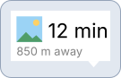

# MapConductor Icons for iOS

Map-ready SwiftUI icon containers and region-neutral glyphs. Use them for application-owned markers such as a hospital symbol inside a pin, circle, flag, or information bubble.

Locale never changes an icon automatically. Choose a regional pack explicitly when local conventions matter.

## Installation

In Xcode, choose **File → Add Package Dependencies** and enter:

```text
https://github.com/MapConductor/ios-icons.git
```

For the current glyph preview, select branch `0.2.0-2` and add the `MapConductorIcons` product. The equivalent `Package.swift` dependency is:

```swift
.package(
    url: "https://github.com/MapConductor/ios-icons.git",
    branch: "0.2.0-2"
)
```

## Quick start

```swift
import MapConductorIcons
import SwiftUI

let hospitalMarker = PinGlyphIcon(
    glyph: CommonMapIcons.hospital,
    fillColor: .red,
    glyphColor: .white
)
```

`PinGlyphIcon` is ready to use as a MapConductor marker icon. The package also provides `CircleIcon`, `FlagIcon`, `RoundInfoBubbleIcon`, and `RightTailInfoBubbleIcon` for their existing image and label use cases. Rendered bitmap icons use a bounded `NSCache`.

## Marker previews

The previews trace each icon's own drawing code at its default parameters, so shapes, sizes, stroke
widths, and colors are the ones you get from `Icon()` with no arguments. Only the photos and the
label text are stand-ins. One deliberate exception: `RoundInfoBubbleIcon` draws its image 32x32 at
(3.2, 3.2), where the left corners overhang the pill's rounded end, so the preview shows a smaller
24x24 image that stays inside the outline. Every marker can be customized through its initializer.

| Marker | Preview | Typical use |
|---|---|---|
| `PinGlyphIcon` |  | A glyph from a common or regional collection |
| `CircleIcon` |  | Route points and compact locations |
| `FlagIcon` |  | Starts, goals, and highlighted positions |
| `RoundInfoBubbleIcon` |  | A photo or category image with a short label |
| `RightTailInfoBubbleIcon` |  | Richer labels with a secondary line |

## Regional packs

- [Japan](https://github.com/MapConductor/ios-icons-jp)
- [United States](https://github.com/MapConductor/ios-icons-us)
- [Weather](https://github.com/MapConductor/ios-icons-weather)

## Contributing icons

Cross-platform artwork and generated API definitions live in the Android source repository. Stable IDs and shapes remain identical across Android, iOS, and React.

<!-- BEGIN GENERATED ICON CATALOG -->
## Included glyphs

Glyph IDs are stable across Android, iOS, and React.

| Preview | API | Stable ID | Description |
|---|---|---|---|
|  | `CommonMapIcons.hospital` | `hospital` | Hospital or medical facility |
<!-- END GENERATED ICON CATALOG -->
